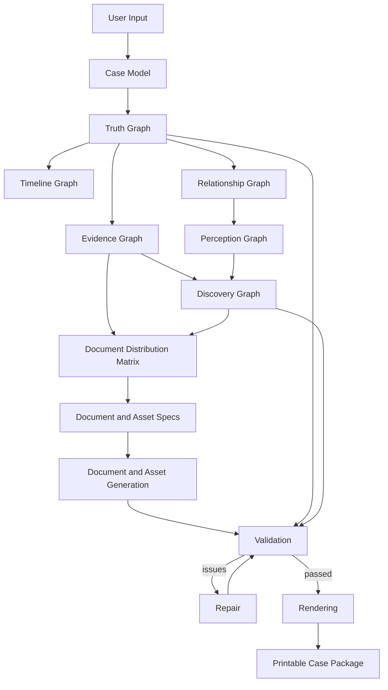

# Architecture Overview

CER models a case engine as a pipeline from hidden truth to printable case package.

The architecture is implementation-independent.

## Conceptual pipeline

## Primary graphs

CER defines six primary graph models:

1. Truth Graph
2. Timeline Graph
3. Relationship Graph
4. Evidence Graph
5. Perception Graph
6. Discovery Graph

## Architectural rule

A generated case SHALL be derived from a hidden truth model.

Documents SHALL be generated from evidence and distribution specifications, not from freeform story prose.

## Implementation relationship

Technologies such as LangGraph, OpenAI, SQLite, DOCX renderers, or Obsidian are implementation choices.

They are not part of the core domain model unless explicitly specified in implementation notes.
