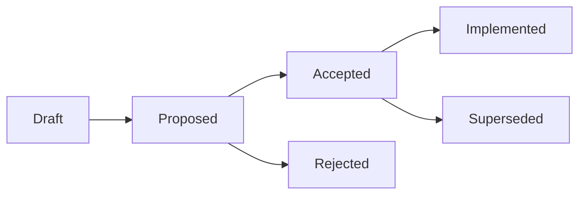

# RFC Process

CER MAY use Requests for Comments (RFCs) for larger proposed changes before they become part of the reference.

## Purpose

An RFC is used when an idea requires discussion before becoming normative.

## Location

RFCs are stored in:

```text
reference/rfcs/
```

## Naming

```text
RFC-0001-discovery-graph.md
RFC-0002-suspect-balance.md
```

## RFC status

Allowed statuses:

- draft
- proposed
- accepted
- rejected
- superseded

## RFC structure

```markdown
# RFC-0001 — Title

## Summary

## Motivation

## Proposal

## Detailed design

## Validation impact

## Alternatives

## Open questions
```

## RFC lifecycle



## When to use RFC instead of ADR

Use an RFC when the design is not decided yet.

Use an ADR after a decision has been made.
