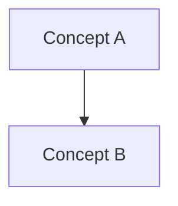

# Style Guide

This guide defines how CER documents SHOULD be written.

## Tone

CER SHOULD be written as a formal technical reference.

Use:

- precise definitions
- normative statements
- concrete examples
- testable requirements

Avoid:

- vague advice
- motivational filler
- implementation-first explanations
- unnumbered rules when a rule ID is needed

## Markdown conventions

Use ATX headings:

```markdown
# Title
## Section
### Subsection
```

Use tables for taxonomies and comparison.

Use fenced code blocks for JSON, YAML, Mermaid, and pseudocode.

## Obsidian links

Use Obsidian wikilinks for internal concepts:

```markdown
[[Truth Graph]]
[[Evidence Graph]]
[[Discovery Graph]]
```

When linking to files with paths, use explicit readable labels:

```markdown
[[00_Specification_Framework/TERMINOLOGY|Terminology]]
```

## Mermaid diagrams

Major conceptual pages SHOULD include at least one Mermaid diagram.

Preferred graph syntax:



## Frontmatter

Each CER document SHOULD include YAML frontmatter:

```yaml
---
id: CER-0000
title: Example
status: draft
version: 0.1
tags:
  - example
---
```

## Status values

Allowed status values:

- draft
- proposed
- accepted
- deprecated
- superseded

## Language

CER source documents are written in English by default to maximize portability.

Norwegian product notes MAY exist in separate commentary files.
