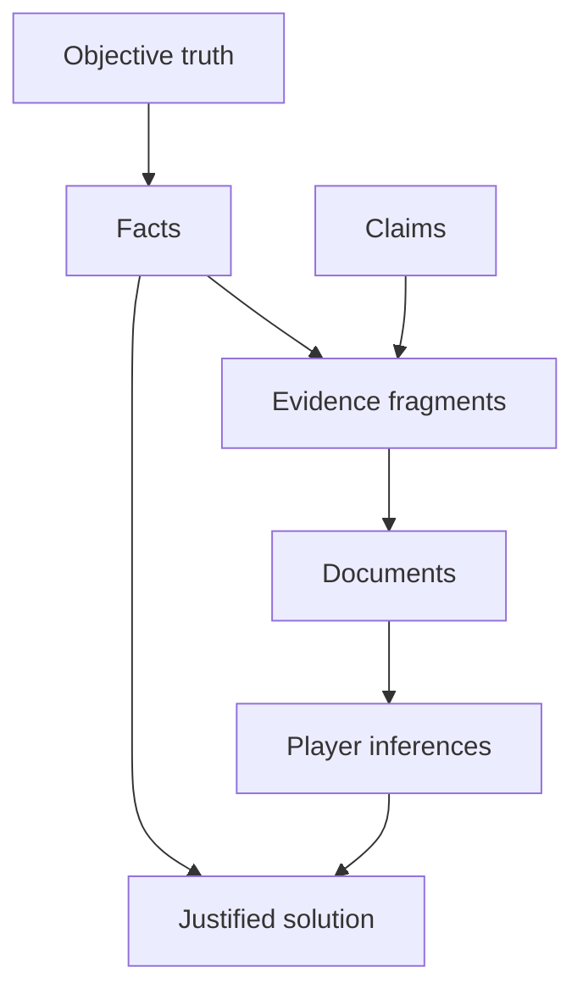

# Case as Information System

A paper-based cold case is best understood as an information system rather than a story.

## Definition

A case information system is a structured network of facts, claims, evidence, documents, relationships, timelines, and player-facing discoveries.

## Why this matters

If a case is treated as a story, generation tends to produce narrative explanation.

If a case is treated as an information system, generation can produce artifacts that must be interpreted.

The player experience should be reconstruction, not consumption.

## Conceptual model

## Normative requirements

A case implementation MUST maintain a hidden representation of objective case state.

A case implementation SHOULD represent claims separately from facts.

A case implementation SHOULD represent document content as derived from evidence fragments.

A case implementation MUST NOT rely on unstructured prose alone as the only source of case truth.

## Design discussion

The information-system model enables the engine to answer practical questions:

- Which facts are necessary to solve the case?
- Which documents expose each fact?
- Which suspects appear plausible at each stage?
- Which clues are redundant?
- Which claims are false or partial?
- Which player hypotheses should collapse later?

Without this model, validation becomes guesswork.

## Implementation notes

A technical implementation MAY store the information system as JSON, graph database records, relational tables, in-memory state, or any other structure.

The storage mechanism is not normative.

The separation between truth, evidence, documents, and discovery is normative.

## Related

- RULE-0001
- ADR-0001
- CER-0101
