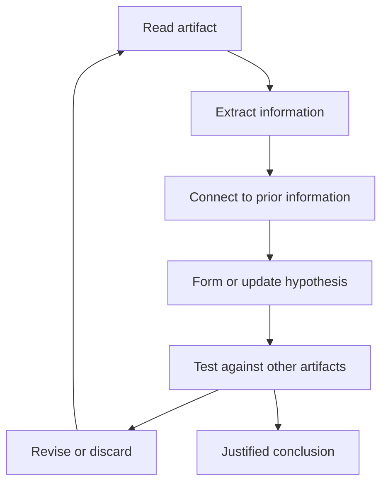

# Investigation Theory

A Case Engine investigation is a structured reasoning process performed by players using limited materials.

## Purpose

This document defines the investigation model used by CER.

## Investigation as reconstruction

Players do not observe the case truth directly. They reconstruct it from artifacts.

A good case allows several early interpretations, then gradually makes some interpretations weaker and others stronger.

## Primary reasoning modes

| Mode | Description | Example use |
|---|---|---|
| Timeline reasoning | Ordering events and testing sequence | Could someone have acted in the available window? |
| Relationship reasoning | Understanding social, family, or professional ties | Why would this person care? |
| Evidence reasoning | Connecting physical, digital, or testimonial material | What supports this fact? |
| Contradiction reasoning | Comparing incompatible claims | Which source is wrong or incomplete? |
| Opportunity reasoning | Matching access, time, and situation | Who could act without being noticed? |
| Motive reasoning | Understanding perceived stakes | What did the suspect believe would happen? |
| Means reasoning | Understanding practical method | Who could obtain or use the method? |

## Hypotheses

A hypothesis is a provisional explanation that players use to organize evidence.

A case SHOULD support multiple plausible early hypotheses.

A case SHOULD provide enough later evidence to eliminate unsupported hypotheses.

## Investigation loop

## Fairness

A case is fair when the player-facing materials contain enough information to justify the intended solution without requiring outside knowledge.

Optional outside knowledge MAY enhance confidence, but it MUST NOT be required for core solvability.

## Related

- CER-0102
- ADR-0003
- RULE-0003
