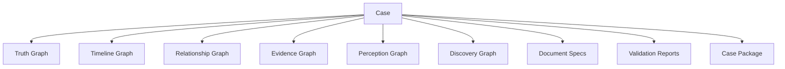

# Case Graph

The Case Graph is the top-level integration graph that connects all primary case models.

## Purpose

The Case Graph gives a Case Engine implementation one navigable structure that ties together truth, timeline, actors, relationships, evidence, perception, discovery, documents, validation, and rendering.

It is not a replacement for the specialized graphs. It is the coordination layer above them.

## Definition

A Case Graph is a graph of references between all major case entities and model outputs.

It answers:

- What is this case about?
- Which models belong to this case?
- Which facts are critical?
- Which documents expose which evidence?
- Which validations apply?
- Which outputs belong in the final package?

## Conceptual structure

## Required case-level metadata

A Case Graph SHOULD reference or contain:

| Field | Description |
|---|---|
| case_id | Stable identifier for the case. |
| title | Working or final title. |
| language | Primary language. |
| setting | Geographic and social setting. |
| genre_profile | Tone, realism, period, and style. |
| difficulty | Intended complexity level. |
| player_count | Intended player range. |
| duration | Expected play duration. |
| primary_question | What players are asked to solve. |
| solution_summary | Facilitator-only compact solution. |
| conformance_level | CER conformance target. |

## Normative requirements

A Case Engine implementation SHOULD maintain a Case Graph or equivalent top-level structure.

The Case Graph SHOULD reference every major generated artifact.

The Case Graph SHOULD make it possible to trace from exported document back to evidence, fact, and validation result.

The Case Graph MUST distinguish player-facing artifacts from facilitator-only artifacts.

## Validation questions

- Does every generated artifact belong to the case?
- Can every player-facing document be traced to its evidence role?
- Are facilitator-only materials separated?
- Are required graphs present for the declared conformance level?

## Related

- CER-0200
- CER-0201
- CER-0204
- CER-0206
