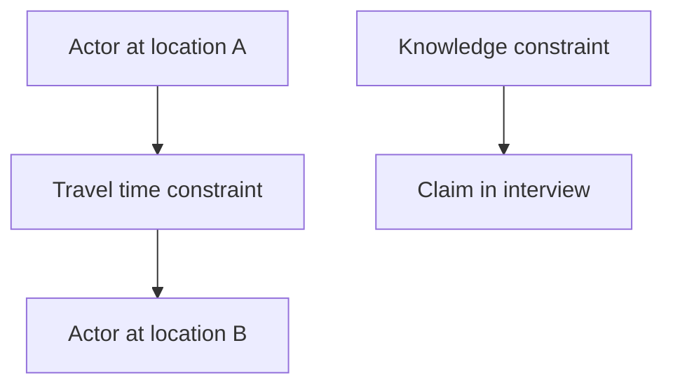

# Constraint Graph

The Constraint Graph models requirements, impossibilities, dependencies, and boundaries that the case must satisfy.

## Purpose

The Constraint Graph helps validators determine whether a generated case is physically, temporally, socially, and logically possible.

It also helps repair agents understand what cannot be changed without breaking the case.

## Definition

A Constraint Graph is a graph of hard constraints, soft constraints, dependencies, exclusions, and validation assumptions.

## Constraint categories

| Category | Description |
|---|---|
| Temporal | Before, after, duration, overlap, travel time. |
| Spatial | Access, distance, visibility, containment. |
| Knowledge | Who can know what and when. |
| Custody | Who controls an object at a time. |
| Causal | One event depends on another. |
| Social | Relationship, authority, trust, fear, obligation. |
| Product | Document count, difficulty, language, rating, format. |
| Spoiler | Player-facing material must not reveal facilitator-only truth. |

## Hard and soft constraints

Hard constraints MUST NOT be violated.

Soft constraints SHOULD be respected unless a repair or design decision explicitly changes them.

## Mermaid example

## Normative requirements

A validator SHOULD extract or receive constraints from core case architecture.

A repair agent SHOULD preserve hard constraints.

A generated case SHOULD distinguish contradiction from impossible constraint violation.

A contradiction may be intentional. An impossible constraint violation is usually a defect.

## Validation questions

- Which constraints must never be violated?
- Which contradictions are intentional?
- Which constraints are merely product preferences?
- What changes would break the solution?

## Related

- CER-0202
- CER-0213
- CER-0214
