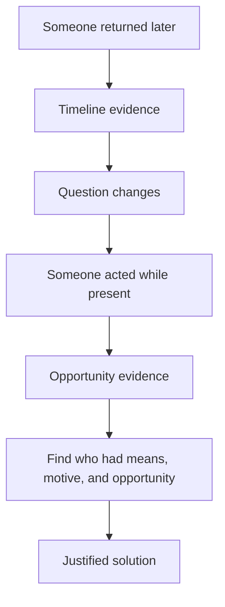

# Discovery Graph

The Discovery Graph models how players can move from initial confusion to justified solution.

## Purpose

The Discovery Graph ensures that a case is not only internally consistent, but also playable.

It models the intended evolution of player understanding.

## Definition

A Discovery Graph is a graph of player-facing insights, hypotheses, hypothesis shifts, confirmations, eliminations, aha moments, and solution dependencies.

## Discovery is not timeline

Timeline asks:

```text
When did events happen?
```

Discovery asks:

```text
When and how can players understand what matters?
```

## Discovery node types

| Node type | Description |
|---|---|
| Initial hypothesis | A plausible early interpretation. |
| Clue exposure | A document or detail that enables inference. |
| Inference | A conclusion players can reasonably form. |
| Hypothesis shift | A change in the core question. |
| Elimination | A suspect or theory becomes weaker. |
| Confirmation | Late evidence supports the intended solution. |
| Aha moment | A meaningful reinterpretation of prior evidence. |

## Mermaid example



## Normative requirements

A complex case SHOULD define a Discovery Graph.

The Discovery Graph SHOULD contain at least one plausible early wrong hypothesis.

The Discovery Graph SHOULD include at least one planned hypothesis shift.

The Discovery Graph SHOULD ensure that the intended solution is not obvious too early.

## Validation questions

- What do players likely think first?
- Which documents support that early theory?
- Which later documents weaken or reframe it?
- Does the culprit become obvious too early?
- Does the final solution feel earned rather than stated?

## Related

- ADR-0003
- CER-0202
- CER-0204
