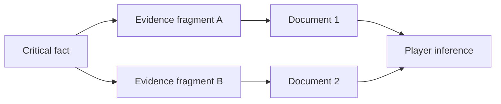

# Document Distribution Matrix

The Document Distribution Matrix defines how facts, claims, evidence fragments, contradictions, and noise are distributed across player-facing documents.

## Purpose

The matrix prevents the generator from placing too much information in one document or leaving critical facts unsupported.

It is the planning layer between the Evidence Graph and generated documents.

## Definition

A Document Distribution Matrix is a structured mapping between information units and document specifications.

It answers:

- Which documents expose which facts?
- Which documents expose which claims?
- Which facts are repeated independently?
- Which documents mislead?
- Which documents support elimination?
- Which documents provide context rather than direct clues?

## Conceptual structure

## Document roles

| Role | Description |
|---|---|
| Anchor | Establishes context and initial frame. |
| Core clue | Contains information required for solution. |
| Support | Reinforces or confirms another clue. |
| Mislead | Supports a plausible but wrong hypothesis. |
| Context | Explains domain knowledge or setting. |
| Noise | Adds realism without being decisive. |
| Eliminator | Weakens a suspect or theory. |

## Normative requirements

The matrix SHOULD be generated before final document prose.

Every critical fact SHOULD appear in at least two independent document exposures.

No single player-facing document SHOULD contain the complete solution.

The matrix SHOULD identify document role, reliability, and discovery function.

## Validation questions

- Are all critical facts exposed?
- Are any critical facts exposed only once?
- Does any single document solve the case?
- Are red herrings distributed fairly?
- Are context clues embedded naturally?

## Related

- CER-0204
- CER-0206
- RULE-0003
- RULE-0004
