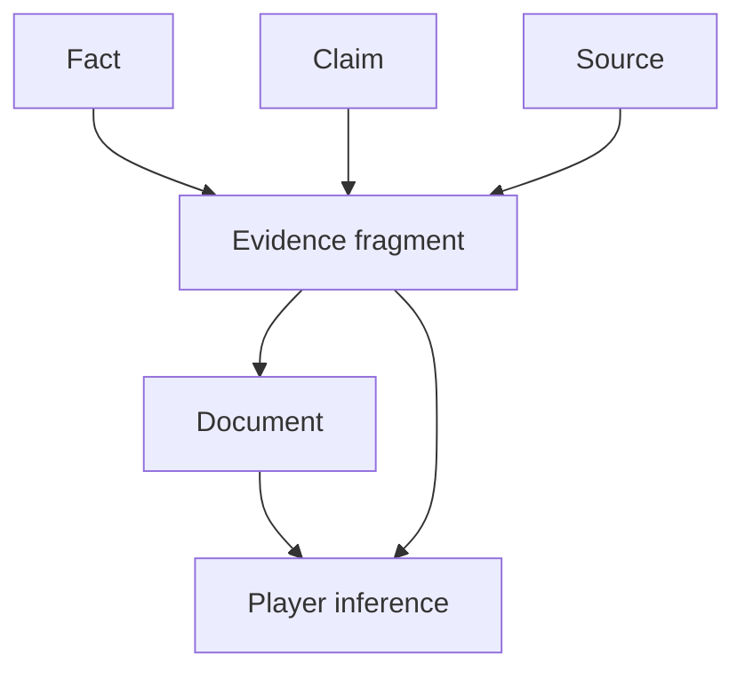

# Evidence Graph

The Evidence Graph models how evidence fragments support, contradict, obscure, or contextualize facts and claims.

## Purpose

The Evidence Graph is the bridge between hidden truth and player-facing documents.

It defines what information exists as evidence before that information is rendered into documents.

## Definition

An Evidence Graph is a graph of evidence fragments, facts, claims, documents, sources, objects, and inference links.

## Evidence fragment

An evidence fragment is a unit of information that can support or challenge an inference.

A fragment may be:

- direct
- indirect
- contextual
- technical
- visual
- testimonial
- administrative
- ambiguous
- misleading

## Conceptual structure

## Evidence functions

| Function | Description |
|---|---|
| Support | Strengthens a fact or inference. |
| Contradict | Challenges a claim or apparent fact. |
| Contextualize | Makes another clue interpretable. |
| Mislead | Supports a plausible but wrong theory. |
| Confirm | Provides late-stage confidence. |
| Eliminate | Removes a suspect or hypothesis. |

## Normative requirements

Critical facts SHOULD be supported by multiple independent evidence fragments.

Evidence fragments SHOULD be linked to player-facing documents or facilitator-only material.

Evidence fragments SHOULD distinguish source reliability from truth value.

The Evidence Graph SHOULD support validation of solvability and redundancy.

## Validation questions

- Which evidence fragments support each critical fact?
- Which fragments are misleading, and are they fair?
- Which fragments only become meaningful after another document is read?
- Is there enough evidence to justify the intended solution?

## Related

- CER-0201
- CER-0207
- RULE-0003
