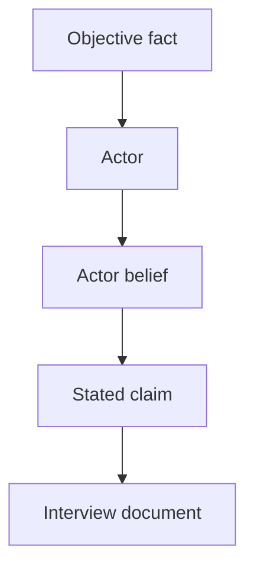

# Perception Graph

The Perception Graph models what each actor knows, believes, hides, misunderstands, or claims.

## Purpose

The Perception Graph allows the engine to generate human documents that are incomplete, biased, emotional, evasive, mistaken, or deceptive without breaking the hidden truth model.

## Definition

A Perception Graph is a graph of actors, facts, claims, beliefs, knowledge states, omissions, misunderstandings, and intentional concealment.

## Actor knowledge dimensions

| Dimension | Meaning |
|---|---|
| Knows | Information the actor correctly knows. |
| Believes | Information the actor thinks is true. |
| Hides | Information the actor avoids revealing. |
| Misunderstands | Information the actor interprets incorrectly. |
| Claims | Information the actor states in a document or interview. |
| Cannot know | Information the actor has no legitimate access to. |

## Mermaid example

## Normative requirements

A generated interview SHOULD be based on the interviewee's perception state.

A character MUST NOT reveal facts they cannot reasonably know unless that access is modeled.

A false statement SHOULD be represented as a claim, not as a fact.

At least one major actor SHOULD be meaningfully wrong, incomplete, or evasive in a complex case.

## Validation questions

- Does each interviewee only describe what they can know or believe?
- Are lies and mistakes represented separately from truth?
- Do source limitations explain contradictions?
- Does the archive include human uncertainty without making the case unsolvable?

## Related

- CER-0203
- CER-0204
- ADR-0002
