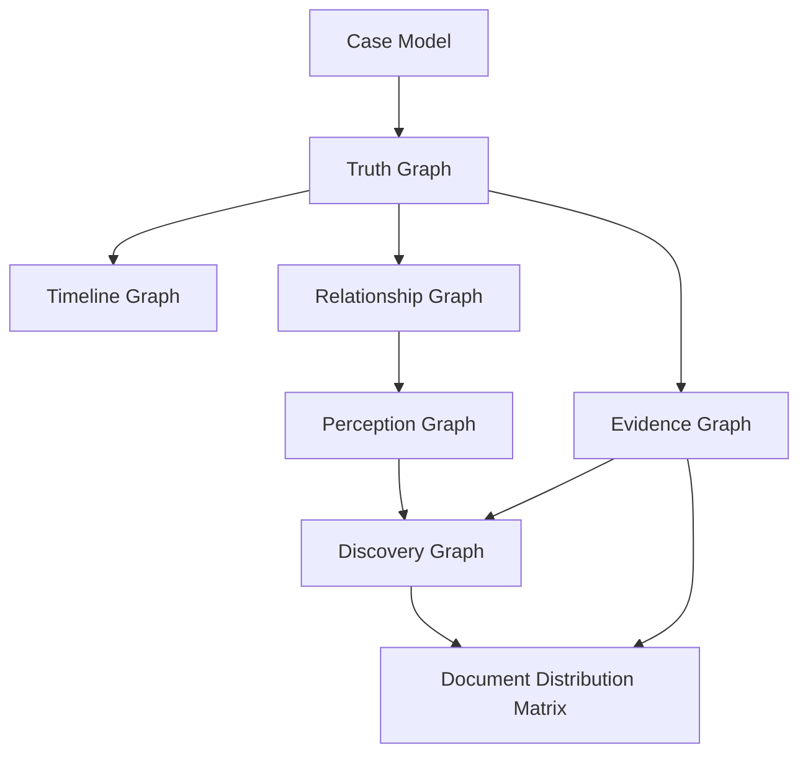

# Case Architecture

Case Architecture defines the primary models used to construct a playable investigation.

## Purpose

The purpose of this volume is to describe the internal structures that exist before documents are written.

A Case Engine implementation SHOULD generate and validate these structures before rendering player-facing material.

## Primary models

| Model | Purpose |
|---|---|
| Case Model | High-level container for the generated case. |
| Truth Graph | Objective hidden reality. |
| Timeline Graph | Ordered and bounded events. |
| Relationship Graph | People, organizations, roles, tensions, loyalties, and secrets. |
| Evidence Graph | Evidence fragments and their links to facts, claims, and documents. |
| Perception Graph | What characters know, believe, hide, and misunderstand. |
| Discovery Graph | How players can gradually understand the case. |
| Document Distribution Matrix | How facts and evidence are exposed across documents. |

## Architectural dependency

## Design rule

A document generation system SHOULD NOT write final player-facing documents until the core case architecture exists.

## Related

- CER-0102
- ADR-0001
- ADR-0002
- ADR-0003
