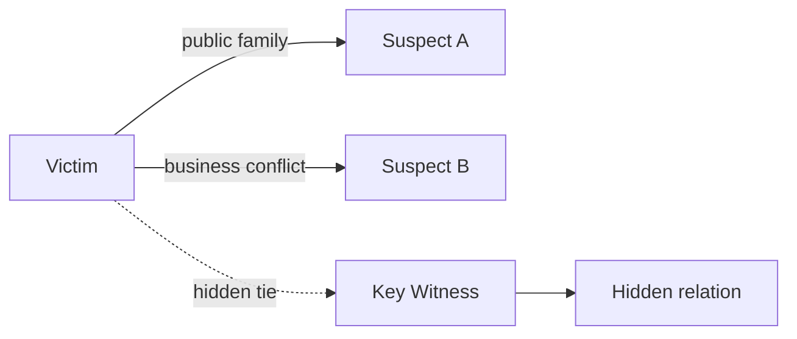

# Relationship Graph

The Relationship Graph models how people, organizations, roles, loyalties, obligations, secrets, and conflicts connect.

## Purpose

The Relationship Graph allows the engine to reason about motive, bias, hidden identity, trust, dependence, resentment, and social access.

## Definition

A Relationship Graph is a graph of actors and their explicit, implicit, hidden, historical, legal, emotional, financial, professional, and biological relationships.

## Relationship categories

| Category | Description |
|---|---|
| Family | Parent, child, sibling, spouse, adoption, unknown relation. |
| Romantic | Current, former, secret, desired, rejected. |
| Professional | Employer, subordinate, partner, rival, client, advisor. |
| Financial | Debt, inheritance, ownership, dependency, insurance. |
| Legal | Representation, guardianship, contract, beneficiary. |
| Social | Friendship, hostility, loyalty, status, reputation. |
| Hidden | Relationship not initially visible to players. |

## Public vs hidden relationships

A relationship MAY have both a public label and a hidden truth.

Example:

```text
Public role: lawyer
Hidden relation: biological child
```

## Mermaid example



## Normative requirements

A Relationship Graph SHOULD distinguish public relationships from hidden relationships.

A Relationship Graph SHOULD support relationships that change meaning after new evidence is discovered.

A Relationship Graph SHOULD identify which actors know each relationship.

A Relationship Graph SHOULD support motive analysis.

## Validation questions

- Do major motives trace back to relationships?
- Are hidden relationships discoverable through evidence?
- Are public roles and true roles clearly separated?
- Do suspect profiles rely on relationships that are actually represented in the graph?

## Related

- PAT-0001
- CER-0201
- CER-0205
