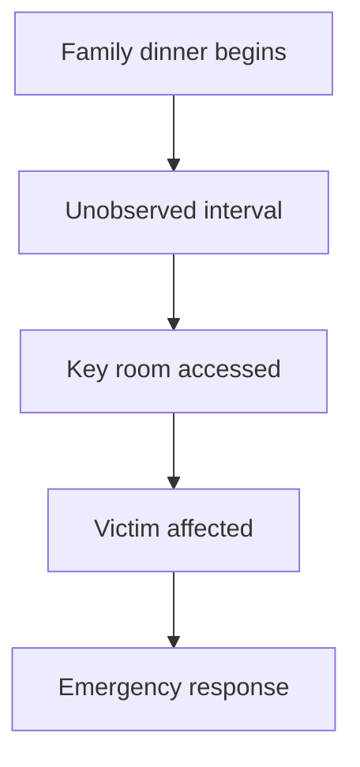

# Timeline Graph

The Timeline Graph models when events happen, when they are believed to happen, and when players can discover them.

## Purpose

The Timeline Graph enables the engine to reason about sequence, opportunity, alibi, contradiction, and discovery order.

## Definition

A Timeline Graph is a graph of temporal events, time windows, ordering constraints, documented timestamps, and disputed or uncertain timing claims.

## Timeline is not discovery

Timeline describes when things happened in the case universe.

Discovery describes when players understand them.

These are separate models.

## Node types

| Node type | Description |
|---|---|
| Event | An in-world occurrence. |
| Time window | A bounded or approximate period. |
| Timestamp | A precise time recorded by a source. |
| Claim time | A time asserted by a person or document. |
| Ordering constraint | A before/after dependency. |
| Gap | A period where information is missing or uncertain. |

## Edge types

| Edge | Meaning |
|---|---|
| before | Event A happened before Event B. |
| after | Event A happened after Event B. |
| overlaps | Events share part of a time window. |
| contradicts | A claimed time conflicts with another source. |
| constrains | A timestamp limits when another event could happen. |
| explains | A later-discovered event clarifies an earlier timestamp. |

## Mermaid example

## Normative requirements

A generated case SHOULD contain a Timeline Graph if time, alibi, opportunity, or sequence matters.

The Timeline Graph MUST distinguish recorded timestamps from human memory claims.

The Timeline Graph SHOULD represent uncertainty explicitly rather than forcing false precision.

A validator SHOULD inspect whether the intended solution is temporally possible.

## Validation questions

- Are any persons required to be in two incompatible places at once?
- Are opportunity windows explicit enough to reason about?
- Are timing contradictions intentional and explainable?
- Does the player-facing archive contain enough timing information to reconstruct the required sequence?

## Related

- CER-0201
- CER-0206
- RULE-0003
