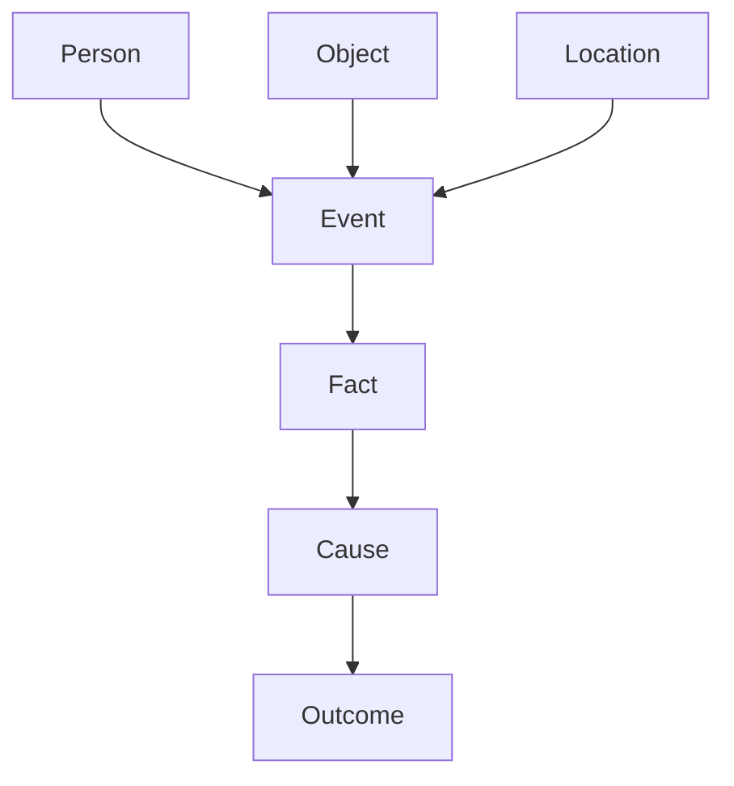

# Truth Graph

The Truth Graph is the authoritative hidden model of objective case reality.

## Purpose

The Truth Graph exists so that generation, validation, repair, and facilitator material can operate from a single canonical representation of what actually happened.

## Definition

A Truth Graph is a graph of objectively true entities, facts, events, relationships, objects, locations, decisions, and consequences within the case universe.

## Scope

The Truth Graph may include:

- objective events
- true identities
- hidden relationships
- actual motives
- perceived motives
- physical actions
- causal links
- object movements
- knowledge states at key moments
- case outcome

## Non-scope

The Truth Graph is not:

- a prose plot summary
- a player-facing timeline
- a facilitator explanation
- a document inventory
- a transcript of every document

## Conceptual structure

## Normative requirements

A Case Engine implementation MUST maintain an authoritative hidden model equivalent to a Truth Graph.

The Truth Graph MUST distinguish objective facts from claims made in documents.

The Truth Graph SHOULD include enough structure to validate timeline, relationship, motive, means, opportunity, and method.

The Truth Graph MUST NOT be exposed directly in player-facing material.

## Minimum node categories

| Node category | Description |
|---|---|
| Person | Victim, suspect, witness, investigator, or contextual actor. |
| Event | Something that happened in the case universe. |
| Object | Physical or digital object relevant to the case. |
| Location | Place where an event or object matters. |
| Fact | Atomic true statement. |
| Cause | Causal link between facts or events. |
| Outcome | Result that follows from prior causes. |

## Validation questions

- Does every critical solution fact exist in the Truth Graph?
- Are claims separated from facts?
- Can every major document trace back to truth, perception, or deliberate misinformation?
- Does the graph support the facilitator explanation?

## Related

- ADR-0001
- RULE-0001
- CER-0200
