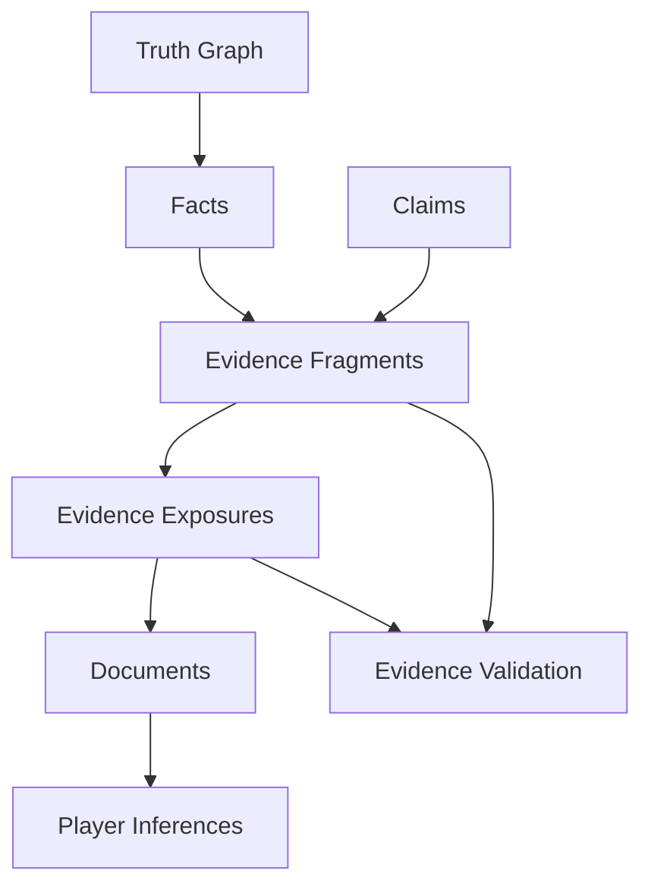

# Evidence System

The Evidence System defines how facts, claims, clues, contradictions, context, and misleading information are represented before they become documents.

## Purpose

Evidence is the bridge between hidden truth and player reasoning.

The Evidence System ensures that generated cases are fair, traceable, redundant, and solvable without relying on accidental prose.

## Core topics

| Topic | Purpose |
|---|---|
| Evidence Model | Defines the overall evidence domain. |
| Evidence Fragment | Defines units of evidence. |
| Evidence Exposure | Defines how evidence appears to players. |
| Evidence Strength | Defines how strongly evidence supports inference. |
| Evidence Reliability | Defines source and interpretation reliability. |
| Evidence Redundancy | Defines repeated independent support. |
| Critical Facts | Defines solution-required facts. |
| Context Clues | Defines embedded knowledge needed to interpret evidence. |
| Corroboration | Defines independent support between evidence sources. |
| Contradictions | Defines conflicting claims and signals. |
| Red Herrings | Defines fair misleading structures. |
| Means, Motive, Opportunity Evidence | Defines evidence supporting suspect analysis. |

## Evidence pipeline

## Core rule

Evidence MUST be traceable.

A generated case SHOULD allow a validator to trace from a player-facing clue back to an evidence fragment, fact, claim, and document role.

## Relationship to documents

Documents do not invent evidence.

Documents expose evidence.

The Document System specifies how evidence is rendered as official reports, interviews, messages, records, photos, notes, media, and context artifacts.

## Related

- CER-0204
- CER-0207
- RULE-0003
- RULE-0004
