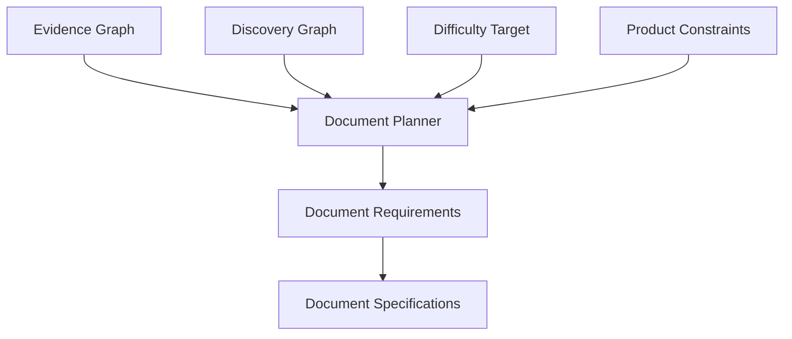

# Document Planner

The Document Planner transforms evidence and discovery needs into a set of document requirements.

## Purpose

The Document Planner exists so that documents are selected because they serve the case, not because they are genre defaults.

It is one of the most important planning layers in a Case Engine implementation.

## Definition

A Document Planner is a design process or implementation component that decides which documents are needed, what roles they serve, which evidence they expose, and how they fit the intended discovery experience.

## Inputs

A Document Planner SHOULD consider:

- case model
- truth graph
- evidence graph
- discovery graph
- document distribution matrix
- target difficulty
- target document count
- target play duration
- language and setting
- print and rendering constraints
- desired realism level

## Outputs

A Document Planner SHOULD produce:

- document requirements
- initial document mix
- coverage map for evidence exposures
- suspect balance support
- context clue placement
- red herring distribution
- document count estimate
- spoiler risk notes

## Planning flow

## Normative requirements

A complex case SHOULD use a Document Planner or equivalent planning process.

The Document Planner SHOULD produce requirements before specifications.

The Document Planner SHOULD check evidence coverage before document writing begins.

The Document Planner SHOULD avoid creating documents with no role in evidence, discovery, realism, or facilitation.

## Validation questions

- Does the planned document set expose all critical evidence?
- Does it create enough variety?
- Does it overload one document?
- Does it support the intended discovery curve?
- Does it stay within product constraints?

## Related

- CER-0405
- CER-0406
- CER-0207
- CER-0313
