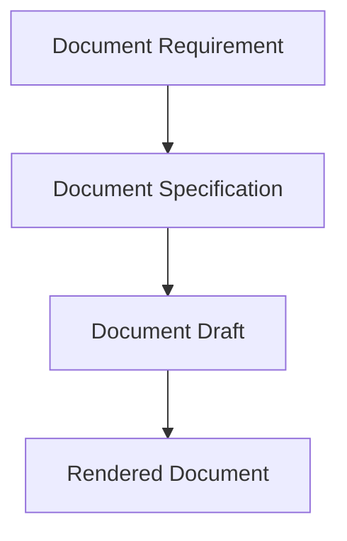

# Document Specification

A Document Specification is the structured blueprint for a document before writing or rendering.

## Purpose

Document Specifications make document generation controllable, traceable, and validateable.

They give writers and renderers enough instruction to produce consistent artifacts without inventing case logic.

## Definition

A Document Specification is a structured description of a document's source, role, evidence exposures, content plan, style, constraints, and rendering requirements.

## Requirement vs specification vs document

A requirement explains why a document is needed.

A specification defines what the document must do.

A draft is written content.

A rendered document is the final artifact.

## Recommended fields

A Document Specification SHOULD define:

| Field | Description |
|---|---|
| document_id | Stable identifier. |
| requirement_id | Requirement being satisfied. |
| document_type | Specific document type. |
| title | Document title. |
| source | Author, organization, system, or unknown source. |
| in_world_date | Date of creation or recording. |
| primary_role | Main investigative role. |
| secondary_roles | Additional roles. |
| evidence_exposures | Required exposures. |
| claims | Claims that should appear. |
| contradictions | Contradictions to include or expose. |
| red_herrings | Misleading structures, if any. |
| noise | Realistic non-critical information. |
| style_profile | Tone, formality, language, register. |
| rendering_profile | Template, layout, asset needs. |
| spoiler_limits | What must not be revealed. |

## Normative requirements

A Document Specification SHOULD be created before final document prose.

A Document Specification SHOULD be traceable to one or more Document Requirements.

A writer agent SHOULD follow the specification and SHOULD NOT invent new critical facts.

A renderer SHOULD follow the rendering profile and SHOULD NOT alter evidence meaning.

## Validation questions

- Does this specification satisfy its requirement?
- Are all required evidence exposures included?
- Does it introduce unsupported facts?
- Does it respect source knowledge limits?
- Is it renderable?

## Related

- CER-0405
- CER-0401
- CER-0312
