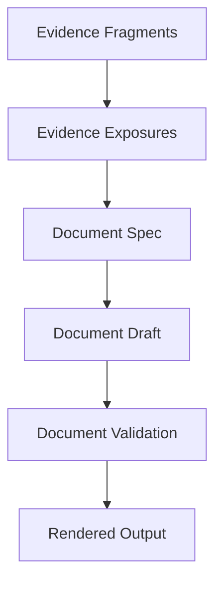

# Document System

The Document System defines how evidence is represented as player-facing and facilitator-only artifacts.

## Purpose

Documents are the player's main interface to the case.

The Document System ensures that documents are realistic, traceable, varied, printable, and useful for investigation.

## Core topics

| Topic | Purpose |
|---|---|
| Document Model | Defines what a document is in CER. |
| Document Metadata | Defines required document fields. |
| Document Roles | Defines investigative roles documents can play. |
| Document Realism | Defines in-world plausibility. |
| Document Taxonomy | Defines families of document types. |
| Document Templates | Defines reusable structures. |
| Document Rendering | Defines presentation requirements. |
| Document Validation | Defines checks for quality and spoiler safety. |

## Document pipeline

## Core rule

Documents SHALL be generated from planned evidence exposures and document specifications.

Documents SHOULD NOT be written as isolated prose without traceability to evidence, claims, and discovery roles.

## Relationship to Evidence System

The Evidence System defines what information needs to be exposed.

The Document System defines how that information appears as artifacts.

## Related

- CER-0300
- CER-0312
- CER-0207
- ADR-0002
