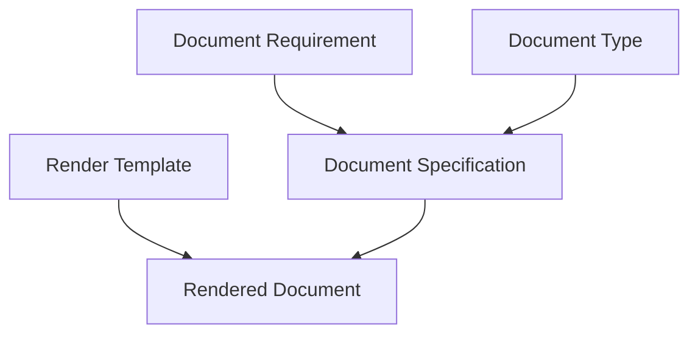

# Document Type Library

The Document Type Library defines reusable document type specifications for case packages.

## Purpose

Document types give the Case Engine a controlled vocabulary for selecting, planning, writing, rendering, and validating artifacts.

A document type is not just a visual template. It describes what the artifact can plausibly contain, what investigative roles it can serve, and how it should be validated.

## Relationship to Document System

The Document System defines the general model for documents.

The Document Type Library defines concrete document families and types that implement that model.

## Type specification structure

Each document type SHOULD define:

- purpose
- when to use it
- typical evidence roles
- typical red herrings
- required metadata
- source realism constraints
- writing constraints
- rendering guidance
- validation checks
- example use cases

## Document type families

| Family | Examples |
|---|---|
| Police | incident report, scene report, interview, evidence log |
| Forensics | autopsy, toxicology, DNA, fingerprint report |
| Medical | medical record, prescription, patient note |
| Digital | email, SMS, chat log, call log, metadata export |
| Financial | bank statement, receipt, invoice, insurance record |
| Personal | diary, letter, note, calendar, photo album |
| Media | newspaper article, TV transcript, blog post |
| Context | safety sheet, brochure, timetable, local guide |
| Legal | will, contract, court record, warrant |
| Visual | photograph, map, floor plan, diagram |

## Normative requirements

A document specification SHOULD reference a known document type when possible.

A document type SHOULD constrain what the document may plausibly know or reveal.

A document type SHOULD define validation checks specific to that artifact.

A renderer SHOULD use document type metadata to select visual treatment.

## Related

- CER-0401
- CER-0406
- CER-0411
- RULE-0011
