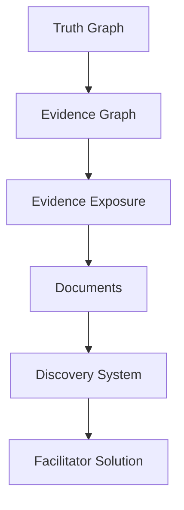

# Discovery System

The Discovery System defines how players move from archive inspection to justified solution.

## Purpose

A homicide investigation game is not only a set of documents. It is a designed reasoning experience.

The Discovery System describes the intended path from uncertainty to explanation without requiring a fixed reading order.

## Core idea

Players receive an archive.

They inspect documents, notice evidence, form hypotheses, compare claims, reject explanations, and eventually reconstruct the most supported account of the homicide.

CER models this process so that cases can be designed, validated, and repaired for player reasoning.

## Discovery is not gating

CER v1.0 assumes a static archive by default.

Players may inspect materials in any order unless a specific product mode defines staged release or optional hints.

Discovery is therefore a reasoning model, not a lock-and-key progression system.

## Core topics

| Topic | Purpose |
|---|---|
| Discovery Model | Defines the overall reasoning structure. |
| Discovery Node | Defines a player-facing insight or realization. |
| Hypothesis Model | Defines possible explanations players may form. |
| Inference Chain | Defines how evidence supports conclusions. |
| Elimination | Defines how hypotheses and suspects are rejected. |
| Suspicion Model | Defines how suspicion changes over play. |
| Confidence Model | Defines confidence in explanations. |
| Discovery Curve | Defines the intended pacing of insights. |

## Relationship to other systems

## Normative requirements

A case SHOULD define its major discovery nodes.

A case SHOULD identify which evidence exposures support each discovery node.

A case SHOULD distinguish intended solution reasoning from plausible wrong hypotheses.

A case SHOULD allow players to justify the solution from player-facing materials.

## Related

- CER-0206
- CER-0300
- CER-0400
- CER-0106
