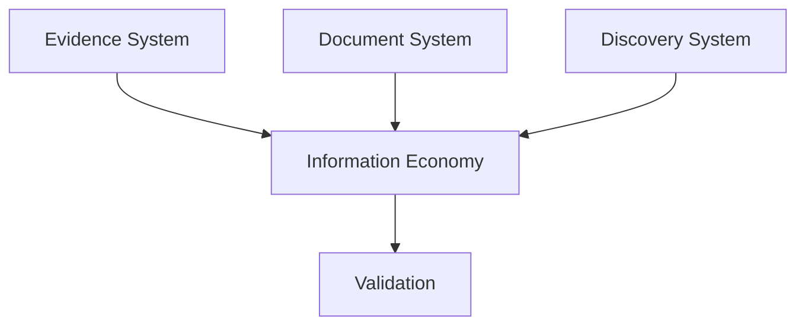

# Information Economy

Information Economy defines how attention, clue density, noise, visibility, cognitive load, and interpretation cost are managed across a case package.

## Purpose

A homicide investigation game is not only about whether information exists.

It is also about how difficult that information is to notice, interpret, connect, and remember.

Information Economy gives CER a vocabulary for designing and validating that experience.

## Core idea

Players have limited time, attention, memory, and certainty.

A case package should allocate information so that players can build justified understanding without being overloaded, underfed, or misled unfairly.

## Core topics

| Topic | Purpose |
|---|---|
| Information Density | How much meaningful information appears per artifact, page, or section. |
| Clue Density | How many investigation-relevant clues appear in a unit of material. |
| Noise | Realistic but non-critical information. |
| Visibility | How easy a clue is to notice. |
| Cognitive Load | How much players must hold in mind. |
| Discovery Cost | How much effort is required to reach an insight. |
| Context Cost | How much background understanding is required. |
| Attention Model | How player attention is directed or dispersed. |

## Relationship to other systems

## Normative requirements

A case SHOULD manage information density intentionally.

Critical clues SHOULD be visible enough for the declared difficulty.

Noise SHOULD support realism without hiding critical information unfairly.

Context cost SHOULD be reduced when a clue depends on specialized knowledge.

## Related

- CER-0300
- CER-0400
- CER-0600
- CER-0106
