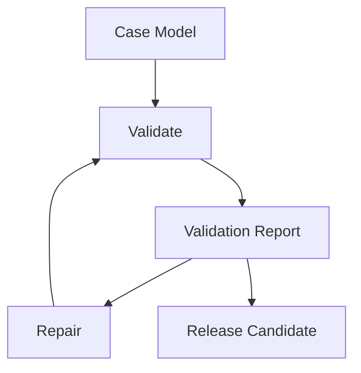

# Validation Framework

The Validation Framework defines how a case package is evaluated for consistency, fairness, solvability, player experience, and release readiness.

## Purpose

A homicide investigation case should not be released only because documents were generated.

It should be checked against the case model, evidence plan, discovery model, document specifications, information economy, failure modes, rendering, and packaging rules.

## Core idea

Validation is the process of determining whether a case is coherent, fair, playable, and compliant with CER.

Validation should produce findings that can be reviewed by humans, used by repair processes, and summarized for release decisions.

## Validation layers

| Layer | Purpose |
|---|---|
| Truth validation | Checks objective case model consistency. |
| Timeline validation | Checks temporal ordering, duration, and opportunity. |
| Evidence validation | Checks critical fact coverage, traceability, and redundancy. |
| Document validation | Checks specification conformance, realism, and spoiler safety. |
| Discovery validation | Checks hypothesis, inference, elimination, and confidence paths. |
| Information economy validation | Checks density, visibility, noise, and cognitive load. |
| Failure mode detection | Checks known structural failure patterns. |
| Rendering validation | Checks final output legibility and evidence preservation. |
| Packaging validation | Checks export completeness and spoiler separation. |

## Validation outputs

A validation process SHOULD produce:

- validation report
- pass, warning, fail, or waiver outcomes
- severity levels
- affected case element IDs
- rule references
- failure mode references
- repair recommendations
- overall quality score if scoring is enabled

## Normative requirements

A case SHOULD be validated before rendering.

Rendered outputs SHOULD be validated before packaging.

Packaging SHOULD be validated before release.

Critical validation failures SHOULD block release unless explicitly waived.

Validation SHOULD be auditable without access to hidden prompts or model internals.

## Relationship to repair

Validation identifies problems.

Repair proposes or applies changes.

A repaired case SHOULD be validated again.

## Related

- CER-0300
- CER-0400
- CER-0600
- CER-0700
- CER-0800
