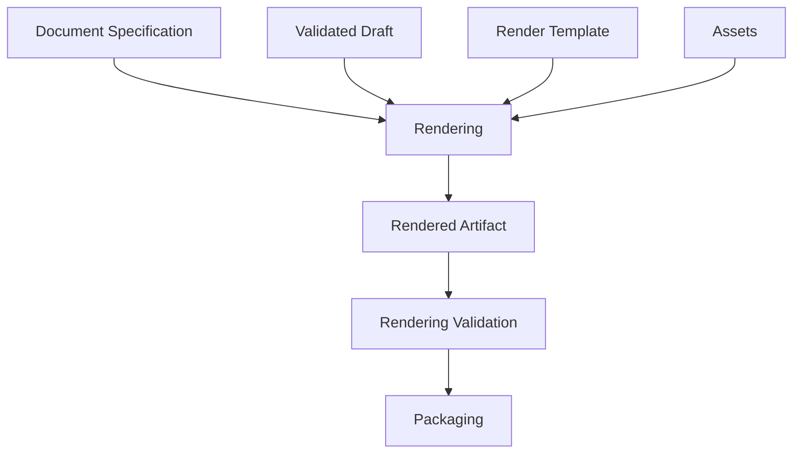

# Rendering Framework

The Rendering Framework defines how validated document content becomes final player-facing and facilitator-only artifacts.

## Purpose

Rendering is not decoration.

Rendering affects clue visibility, realism, spoiler safety, accessibility, printability, and player trust.

A clue that is correct in text may still fail if it is cropped, illegible, visually overemphasized, or placed in the wrong package group.

## Scope

The Rendering Framework covers:

- rendering model
- template selection
- visual clue preservation
- artifact realism
- print readiness
- accessibility
- export formats
- asset handling
- spoiler separation
- rendering validation

## Rendering pipeline

## Core principle

Rendering SHALL preserve evidence meaning.

A renderer may change layout, typography, and visual style, but it must not change the facts, claims, timestamps, visibility intent, or spoiler boundaries defined by the document specification.

## Normative requirements

Rendered artifacts SHOULD be traceable to document specifications.

Visual clues MUST remain legible enough for their intended role.

Facilitator-only artifacts MUST remain separated from player-facing artifacts.

Rendered outputs SHOULD be validated before packaging.

## Related

- CER-0411
- CER-0410
- CER-0903
- CER-0904
