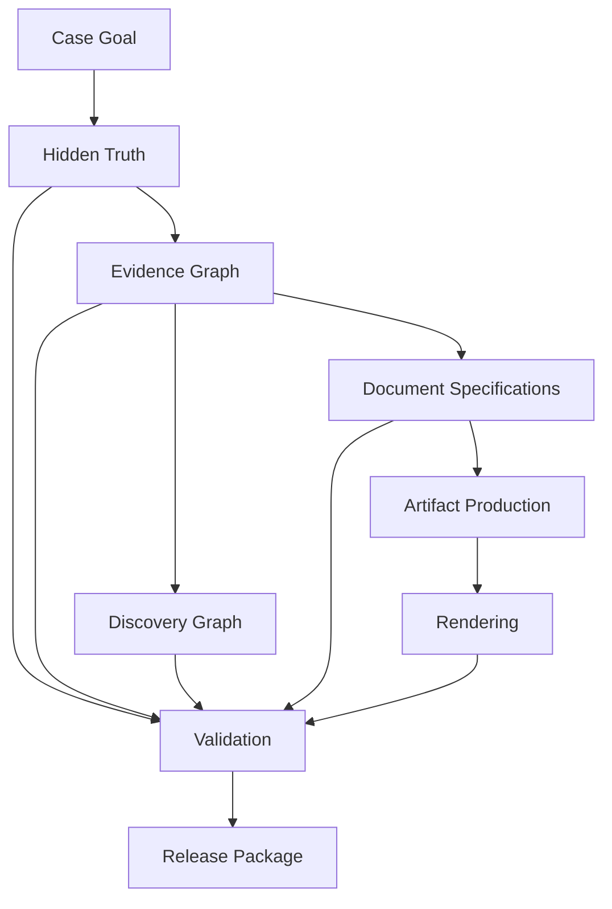

# Case Engine Reference

Welcome to **Case Engine Reference (CER)**.

CER is the authoritative reference for designing, producing, validating, rendering, and packaging document-based investigation cases.

This vault is intended to be read as a specification first. Repository management, release planning, and development history are supporting project material, not CER itself.

## Start here

- [[MASTER_OUTLINE|Master Outline]]
- [[00_Specification_Framework/README|00 — Specification Framework]]
- [[01_Foundations/README|01 — Foundations]]
- [[02_Case_Architecture/README|02 — Case Architecture]]
- [[03_Evidence_System/README|03 — Evidence System]]

## Core specification

- [[00_Specification_Framework/README|00 — Specification Framework]]
- [[01_Foundations/README|01 — Foundations]]
- [[02_Case_Architecture/README|02 — Case Architecture]]
- [[03_Evidence_System/README|03 — Evidence System]]
- [[04_Document_System/README|04 — Document System]]
- [[05_Document_Types/README|05 — Document Types]]
- [[06_Discovery_System/README|06 — Discovery System]]
- [[07_Information_Economy/README|07 — Information Economy]]
- [[08_Failure_Modes/README|08 — Failure Modes]]
- [[09_Validation/README|09 — Validation]]
- [[10_Rendering/README|10 — Rendering]]
- [[11_Artifact_Production/README|11 — Artifact Production]]
- [[12_Case_Engine/README|12 — Case Engine]]
- [[13_Production_Graphs/README|13 — Production Graphs]]
- [[14_Compliance/README|14 — Compliance]]

## Supporting reference material

- [[adr/README|Architecture Decision Records]]
- [[rules/README|Rules]]
- [[patterns/README|Patterns]]
- [[schemas/README|Schemas]]
- [[tests/README|Tests]]
- [[extensions/README|Extensions]]

## Project material

Project material describes how this repository is maintained and released. It is not part of the CER specification.

- [[README|Repository README]]
- [[ROADMAP|Roadmap]]
- [[CHANGELOG|Changelog]]
- [[15_V1_Hardening/README|Release Readiness Material]]

## Core idea

A playable investigation case is not a linear story. It is an information system.

## Navigation tips

Use Obsidian backlinks and graph view to explore how the specification connects across truth, evidence, documents, discovery, rendering, artifact production, validation, compliance, and release packaging.
