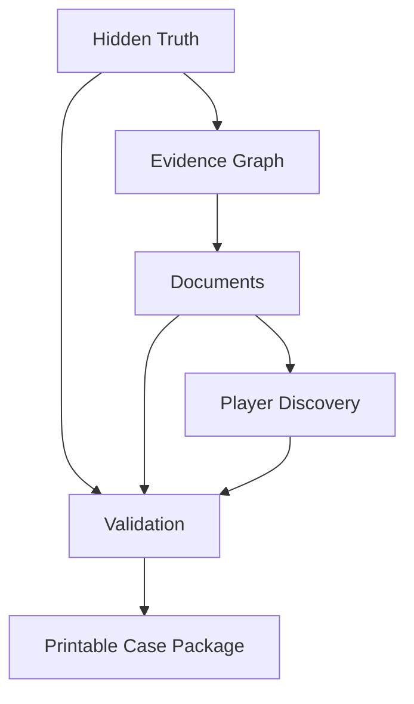

# Case Engine Reference Home

Welcome to **Case Engine Reference (CER)**.

CER is the authoritative specification for the Case Engine ecosystem.

## Start here

- [[MASTER_OUTLINE]]
- [[ROADMAP]]
- [[00_Specification_Framework/ARCHITECTURE_OVERVIEW|Architecture Overview]]
- [[00_Specification_Framework/TERMINOLOGY|Terminology]]
- [[00_Specification_Framework/SPECIFICATION_LANGUAGE|Specification Language]]

## Core idea

A playable cold case is not a linear story. It is an information system.

## Current milestone

**M0 — Specification Framework**

This milestone defines how CER itself is written and maintained.

## Future volumes

- Volume I — Foundations
- Volume II — Case Architecture
- Volume III — Evidence System
- Volume IV — Document System
- Volume V — Player Experience
- Volume VI — AI Generation Engine
- Volume VII — Validation
- Volume VIII — Rendering
- Volume IX — Facilitator Mode
- Volume X — Reference and Appendices
